<a id="top"></a>

<p align="center">
  
</p>

<p align="center">
  <a href="CHANGELOG.md"></a>
  <a href="LICENSE"></a>
  <a href="https://code.claude.com/docs"></a>
</p>

<p align="center">
  <strong>A pixel pet for Claude Code that turns your coding sessions into a small game.</strong>
</p>

<p align="center">
  <a href="#install">Install</a> ·
  <a href="#features">Features</a> ·
  <a href="#commands">Commands</a> ·
  <a href="#how-progress-works">Progress</a> ·
  <a href="#privacy-and-data">Privacy</a> ·
  <a href="#faq">FAQ</a> ·
  <a href="#contributing">Contributing</a>
</p>

> [!NOTE]
> Clawd Quest is an unofficial fan project. It is not affiliated with, endorsed by or sponsored by Anthropic. See the [Disclaimer](#disclaimer).

## What is this?

Clawd Quest gives you **Clawd**, an animated pixel pet who lives in a side pane next to your Claude Code session. He reacts to what Claude Code is doing: he types at the desk while files are edited, runs to the terminal for shell commands, reads at the bookshelf and celebrates when tests pass.

Your work earns XP. Every project folder has its own level (up to 100), daily streak, daily and project quests, trophies, hats and room decor.

<p align="center">
  
</p>

## Install

Requires **Claude Code 2.1.288 or newer**, in the terminal or the desktop Code tab.

### Quick start

**1. Add the marketplace**

```bash
claude plugin marketplace add ImTBY/clawd-quest
```

**2. Install the plugin**

```bash
claude plugin install clawd-quest@clawd-quest
```

**3. Restart Claude Code.**

### First run

After the restart, every new session opens the Clawd pane automatically, in the terminal or the desktop Code tab.

- `/clawd` hides or shows the pane. A closed pane stays closed across sessions until you run `/clawd` (or `/quests`, which reopens it).
- In a terminal, Claude Code only places a pane that opens on its own when the window is at least 144 columns wide (110 once you have opened the Clawd pane yourself). Below that it waits; `/clawd` opens it at any width.

> [!TIP]
> Want a game plan for your project right away? Run `/quests` and watch the Quests tab (on the desktop).

### Update and uninstall

To update, refresh the marketplace:

```bash
claude plugin marketplace update clawd-quest
```

Then update the plugin:

```bash
claude plugin update clawd-quest@clawd-quest
```

Then restart Claude Code.

To uninstall:

```bash
claude plugin uninstall clawd-quest@clawd-quest
```

Your saves stay. To delete your progress too, remove the save file (see [Saves](#saves)).

<p align="right"><a href="#top">Back to top</a></p>

## Features

- **A living room.** Clawd wanders, thinks in a thought bubble, celebrates with confetti, shakes on errors and falls asleep after a few idle minutes.
- **Activity stations.** Clawd goes where the work is, with a station for every kind of tool call.
- **Usage meters in the room.** Context, rate limits and compactions show up as objects you can glance at.
- **900+ quips** that react to the project, time of day, long turns, error streaks, combos, levels, seasons, usage limits, your hat and your prompts.
- **A themed spinner.** The "Working..." row gets a tiny Clawd and its own verbs (Scuttling, Clawding, Terraforming...).
- **Progression per project:** levels to 100, Encore stars beyond, streaks, combos, 3 daily quests, 80 trophies (12 hidden), 44 hats and 98 unlockable decor pieces in 12 slots.
- **Project quests (`/quests`).** Clawd reads your project and asks a model for a campaign of project-specific quests, milestones and pixel-art hats.
- **Terminal and desktop:** runs in the desktop Code tab and in the terminal, where Clawd is drawn in block characters with a compact stats view.

### Activity stations

<table>
  <tr>
    <td align="center" width="33%"><br><sub><b>Coding</b> · types code at the PC; a new file types in line by line</sub></td>
    <td align="center" width="33%"><br><sub><b>Terminal</b> · runs commands at the green terminal</sub></td>
    <td align="center" width="33%"><br><sub><b>Tests</b> · pumps a fist at a column of checkmarks</sub></td>
  </tr>
  <tr>
    <td align="center" width="33%"><br><sub><b>Git</b> · throws a paper plane out of the window</sub></td>
    <td align="center" width="33%"><br><sub><b>Reading</b> · pulls the gold book off the shelf</sub></td>
    <td align="center" width="33%"><br><sub><b>Search</b> · scans the spines with a magnifier</sub></td>
  </tr>
  <tr>
    <td align="center" width="33%"><br><sub><b>Web</b> · watches through binoculars, radio on the sill</sub></td>
    <td align="center" width="33%"><br><sub><b>Terraform</b> · pulls the crane's lever</sub></td>
    <td align="center" width="33%"><br><sub><b>Subagents</b> · ticks off a clipboard while mini Clawds run errands</sub></td>
  </tr>
  <tr>
    <td align="center" width="33%"><br><sub><b>Skills</b> · casts from a floating spellbook</sub></td>
    <td align="center" width="33%"><br><sub><b>Thinking</b> · ponders in a thought bubble</sub></td>
    <td align="center" width="33%"><br><sub><b>Sleeping</b> · naps in his bed after a few idle minutes</sub></td>
  </tr>
  <tr>
    <td align="center" colspan="3"><br><sub><b>Error</b> · shakes in front of a red error screen</sub></td>
  </tr>
</table>

### Usage meters

- A **paper stack** on the desk grows with the context window.
- An **hourglass** on the window sill runs down with the 5-hour limit.
- A **wall calendar** crosses off the weekly limit.
- An **archive box** under the desk collects each `/compact`.

Clawd says one line when the 5-hour or weekly limit reaches 80% or the context reaches 85%. With an API key (no rate limits), the hourglass and calendar are hidden.

### Time of day and seasons

The window follows your real time of day, and the wall clock shows the real time. October brings a pumpkin and bats, December a tree, winter snow on the sill, and spring butterflies.

<p align="center">
  
</p>

<p align="right"><a href="#top">Back to top</a></p>

## Commands

| Command | What it does |
|---|---|
| `/clawd` | Open or close the Clawd pane |
| `/quests` | Generate project quests, milestones and project hats |
| `/quests <focus>` | The same, with a focus, e.g. `/quests tests` |
| `/quests clear` | Drop this project's open quests; its trophies and hats stay |
| `/quests reset` | After you confirm with `/quests reset confirm`, removes this project's quests, milestones, project trophies and project hats. Your level, daily quests and catalog hats stay. |
| `/quests allow <script>` | Count a project script as a quest check, e.g. `/quests allow npm test` |
| `/quests help` | List the `/quests` commands |

On the desktop, the pane has five tabs: Room, Quests, Trophies, Wardrobe and Decor. New hats and decor wear a star (and their tab a dot) until you have seen them. The header names the project and shows your level, XP, streak and next unlock.

### How `/quests` works

1. **Clawd scouts the project:** file names, README, detected stack and your recent prompts (exactly what is sent is listed under [Privacy and data](#privacy-and-data)).
2. **A model proposes a campaign:** a warm-up, up to three regular quests and a boss, plus long-term milestones that become project trophies and pixel-art hats designed for this project.
3. **Clawd checks every proposal** against the [quest rules](docs/QUEST_RULES.md). Bad quests are dropped and replaced, never the whole campaign.
4. **Clawd measures progress itself:** a known check (like `pytest` or `terraform validate`) passing after an edit, or a measured change in the files. A check counts only when you (or Claude, under your usual permissions) run it anyway. XP comes from Clawd's own rules, never from the model.
5. **One Swap per campaign** replaces a quest you would rather not do (its progress is lost).

You can start a new campaign once the current one is done, or the next day. Finished quests stay in your history. Once all project milestones are done, the next campaign adds a new tier.

<p align="right"><a href="#top">Back to top</a></p>

## How progress works

**Progress is per project.** XP, level, streak, best combo, daily quests, trophies, hats, the hat Clawd wears, the room decor and the `/quests` board belong to one project folder. Every session in that folder shares one save; a different folder starts at level 1. Desktop scratch chats share one save.

<details>
<summary><b>Earning XP</b></summary>

| Source | XP |
|---|---|
| An edit, write, test or Terraform tool call that succeeds | 1 |
| Any other tool call (read, search, web, shell, git, skill, MCP…) | 1 on every second tool call |
| Delegating to a subagent | 2 |
| A failing tool call (you learn from mistakes) | 1 on every third error |
| Combo bonus, on every 10th call of a combo | combo / 10, at most 3 |
| A finished turn | 2, plus 1 when it used tools without an error |
| The first prompt or tool call of the day | 10, plus 2 per streak day beyond the first (at most 30) |
| A daily quest | about 10 to 25 |
| Daily Sweep (all 3 daily quests, claimed the same day) | 15 |
| A trophy | 5, 20 or 50 by difficulty; 15 for a hidden one |
| A project quest | Priced by Clawd from its check, goal and role |
| A finished `/quests` campaign | 40 bonus, for at most two campaigns a day |

</details>

<details>
<summary><b>Levels and titles</b></summary>

Reaching level `L` takes `40 × (L − 1)^1.6` XP in total, rounded. The first levels come within a day; at a regular pace (2 to 4 hours a day, 5 days a week) level 10 takes about a week and level 100 about a year.

| Level | Total XP |
|---|---|
| 2 | 40 |
| 5 | 368 |
| 10 | 1,345 |
| 25 | 6,462 |
| 50 | 20,248 |
| 75 | 39,159 |
| 100 | 62,384 |

| Levels | Title |
|---|---|
| 1-4 | Hatchling |
| 5-9 | Apprentice |
| 10-24 | Journeyman |
| 25-39 | Expert |
| 40-49 | Veteran |
| 50-74 | Master |
| 75-99 | Grandmaster |
| 100 | Legend |

</details>

### Milestones and Encore stars

Levels 10, 25, 50, 75 and 100 are milestones. Each opens a bundle of hats and decor, celebrates in the room and upgrades the room for good: a level badge under the trophy shelf that turns bronze, silver, gold and platinum, gold trim on the shelves, wainscoting, shooting stars in the night window and a gold window frame.

The level stops at 100, but XP keeps counting: every 1,000 XP past level 100 earns an **Encore star** (`Lv 100 ★3`). Every star gets a small celebration and every fifth a big one; 10 stars earn the Encore trophy.

<p align="center">
  
</p>

<p align="center">
  
</p>

### Streaks, combos and daily quests

- **Streaks** count days with a prompt or a tool call in that project (just opening a session does not count). Weekends are safe: Friday to Monday keeps the streak going.
- **Combos** grow with tool calls in a row and reset after an error or 2 minutes idle. Denying a permission prompt doesn't break it.
- **Subagent tool calls** do not count toward XP, combos or quests; delegating to a subagent does.
- **Daily quests** fit any project: turns, prompts, edits, reads, tool calls, clean or quick turns and combos. Finish all 3 in a day for a Daily Sweep: a *Claim +15 xp* button shows in the pane until midnight.

### Trophies, hats and decor

- **80 trophies**, 12 of them hidden. On the desktop, the Trophies tab shows the newest first and the next three up with their progress, plus project trophies from `/quests`. *Explorer*, for example, is earned by working in the same project on 5 different days.
- **44 hats**, unlocked with levels, trophies and seasons, plus pixel-art project hats from `/quests`.

<p align="center">
  
</p>

- **98 unlockable decor pieces in 12 slots:** drink, plant, poster, rug, shelf, roommate, bed, lamp, clock, ceiling, wall hanging and window view. An energy drink arrives at level 5, a cat roommate at level 10, and much more along the way. On the desktop, the Decor tab previews every piece.

<p align="center">
  
</p>

<p align="right"><a href="#top">Back to top</a></p>

## Privacy and data

Nothing leaves your machine unless you run `/quests`, and Clawd spends no tokens otherwise.

- **Local by default.** Clawd watches Claude Code's hook events (tool calls, prompts, turns, usage) in the running session and keeps its game state in the local plugin store.
- **`/quests` asks a model, on your account.** Generating a campaign makes 1 model call, or 2 when Clawd asks the model to repair a reply. It uses Sonnet, falling back to Haiku or your session's model, and counts toward your usage like any other request.
- **Exactly what `/quests` sends:**
  - the project folder's name;
  - the detected stack (like `terraform, python`);
  - up to 400 file and folder names, at most three levels deep, leaving out secret files, binary files (documents, images, archives…), dependency and build folders, lockfiles and generated files;
  - the first 1,500 characters of the README;
  - your last 6 prompts in this session, up to 200 characters each (slash commands are not kept);
  - the last 5 tool actions (like `edit main.tf`);
  - the focus you typed after `/quests`.

  No other file contents are sent. The model is told to treat all of it as data, never as instructions.
- **Measured quests read files locally.** To track a quest, Clawd reads the files it measures (never secret or binary files, never a file over 256 KB). That never leaves your machine.
- **Secrets are off-limits.** Clawd never opens `.env` files, keys, certificates or credential files, and leaves their names out of what `/quests` sends; quests that touch secrets, keys or production are refused.

  <details>
  <summary>The full list of off-limits files</summary>

  `.env*`, keys and certificates (`.pem`, `.key`, `.pfx`, `.p12`, `.p8`, `id_*`), `.kdbx` password databases, `.ssh/` and `.aws/` folders, `kubeconfig`, `.npmrc`, `.pypirc`, `.netrc`, `.git-credentials`, Docker configs (`.dockercfg`, `.docker/config.json`), `credentials*.json`, `service-account*.json`, `secrets.*`, `*.tfvars`, `*.tfstate`, `*config*.php`, `settings.py`, `local.settings.json` and `appsettings.*.json`. See the [quest rules](docs/QUEST_RULES.md) for everything `/quests` may and may not touch.

  </details>

- **No environment variables.** Clawd runs inside Claude Code's plugin runtime and only sees what Claude Code passes it; it does not read your environment variables.
- **Clawd never runs commands.** No command, script or tool is ever run by Clawd, and nothing in a model reply can make it run one. It reads only the project's file names, the README and the files a quest measures, and writes only to its own plugin store.

### Saves

Progress is stored locally in Claude Code's plugin store, `~/.claude/plugins/store/`, in one JSON file for the plugin; inside it, every project folder has its own save. Parallel chats in the same project won't overwrite each other.

The file name depends on where the plugin was installed from: `clawd-quest_inline-<id>.json` for a `--plugin-dir` install, a similarly named `clawd-quest_…json` file for the marketplace install. Uninstalling leaves the file in place.

<p align="right"><a href="#top">Back to top</a></p>

## FAQ

<details>
<summary><b>How do I turn Clawd off?</b></summary>

Run `/clawd`, or close the pane. It stays closed across sessions until you run `/clawd` (or `/quests`) again. To remove him entirely, uninstall (see [Update and uninstall](#update-and-uninstall)).

</details>

<details>
<summary><b>Why does a different project start at level 1?</b></summary>

Progress is per project on purpose: each folder has its own level, streak, trophies, hats and decor. Every chat in the same folder shares one save.

</details>

<details>
<summary><b>I switched from <code>--plugin-dir</code> to the marketplace install and my level is gone.</b></summary>

It is not gone: saves are kept per install source (see [Saves](#saves)). To carry your progress over, start the new install once (so its file exists), quit Claude Code, then copy the old file over the new one.

</details>

<details>
<summary><b>How do I start over?</b></summary>

With Claude Code closed, delete the store file to start every project from scratch. To clear only one project's quests, project trophies and project hats, use `/quests reset`.

</details>

<details>
<summary><b>Does Clawd run commands?</b></summary>

No. Quest checks such as `pytest` or `terraform validate` count only when you (or Claude, under your usual permissions) run them anyway; Clawd only watches the result. `/quests allow <script>` lets a project script you already run count as a check; it does not run it.

</details>

<details>
<summary><b>The pane did not open in my terminal.</b></summary>

In a terminal, Claude Code only places a pane that opens on its own when the window is at least 144 columns wide (110 once you have opened the Clawd pane yourself). Below that it waits; `/clawd` opens it at any width.

</details>

<details>
<summary><b>Does it work with an API key instead of a subscription?</b></summary>

Yes. Without rate limits the hourglass and calendar meters are hidden; everything else works. `/quests` model calls are billed like any other request.

</details>

<details>
<summary><b>Does it respect reduced motion?</b></summary>

Yes. With the system's reduced-motion setting on, the room's looping animations stop or slow down.

</details>

<p align="right"><a href="#top">Back to top</a></p>

## Contributing

Want to hack on Clawd? See [CONTRIBUTING.md](CONTRIBUTING.md) for running from a clone, tests and the repository layout.

Found a bug or Clawd misbehaving? [Open an issue](https://github.com/ImTBY/clawd-quest/issues).

## Disclaimer

Clawd Quest is an unofficial fan project by ImTBY. It is not affiliated with, endorsed by, sponsored by or supported by Anthropic, PBC. "Claude", "Claude Code" and "Anthropic" are trademarks of Anthropic, PBC; they are used here only to say what this plugin works with, and no endorsement is implied. Clawd, Claude Code's crab mascot, appears here as fan art. The software is provided as is, without warranty; see the license.

## License

[PolyForm Noncommercial 1.0.0](LICENSE). Copyright (c) 2026 ImTBY.

You may use, modify and share Clawd Quest for free for any noncommercial purpose: personal use, hobby projects, study, research, and use by charities, schools and public institutions. Selling it or using it commercially needs the author's permission.

<p align="right"><a href="#top">Back to top</a></p>
